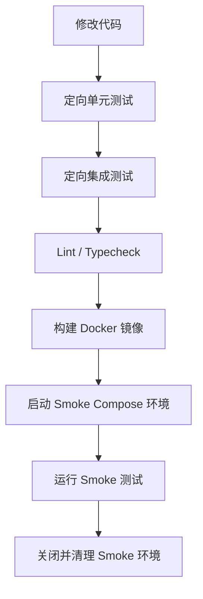

# 开发测试固定流程

本文档用于固定 `agent-engine` 项目从“修改代码”到“Smoke 验证”的标准执行顺序，作为本地开发、后续 `Makefile` 封装和 CI 流水线的共同依据。

## 1. 目标

当前阶段的目标不一定是一次性搭建完整的大型测试平台，而是先把下面这条链路稳定下来，以保障大模型 Agent 图和接口通讯逻辑的可靠性：

1. 修改代码
2. 运行定向单元测试
3. 运行定向集成测试
4. 运行静态检查
5. 构建 Docker 镜像
6. 启动 Smoke 测试环境
7. 运行 Smoke 测试
8. 清理 Smoke 环境

这条流程适用于日常开发回归、提交前自检，以及后续接入 CI。

## 2. 流程总览



## 3. 固定执行顺序

### 步骤 1：修改代码

开发者先完成本次需求或修复的代码修改。

要求：

- 优先做小步修改，特别是涉及 Prompt 和 LangGraph 节点（Node）的调整。
- 每一轮修改后尽快跑定向测试，不要攒到最后一起验证。
- Python 相关命令统一使用 `uv run`。

### 步骤 2：运行定向单元测试

目的：

- 先验证当前变更的最小逻辑单元（如特定工具调用、纯函数提取逻辑）是否正确。
- 这一步应当最快，适合作为开发过程中的高频反馈。采用 mock 技术避免真实调图大模型。

示例：

```bash
make qa-test-unit UNIT_TARGETS=tests/unit/graphs/test_generate_node.py
```

如果你想执行原生命令：

```bash
uv run pytest tests/unit/graphs/test_generate_node.py
```

通过标准：

- 单元测试全部通过后，才进入下一步。

### 步骤 3：运行定向集成测试

目的：

- 验证节点间编排流转、Agent 模块与存储（如 `mem0ai`/`aiosqlite` 记忆层）、MCP 协议扩展服务的协作是否依然正确。
- 这一步关注联调逻辑和上下文状态切换。

示例：

```bash
make qa-test-integration INTEGRATION_TARGETS="tests/integration/test_memory.py tests/integration/test_mcp_client.py"
```

通过标准：

- 定向集成测试通过后，才进入下一步。

### 步骤 4：运行静态检查

目的：

- 在构建镜像前，先用静态分析拦截明显代码问题。本项目使用 `Ruff` 和 `Ty` (Type check) 等。

命令：

```bash
make qa-lint
make qa-typecheck
```

对应的原生命令：

```bash
uv run ruff check .
uv run ty
```

说明：

- `lint` (Ruff) 用于风格、导入和常见错误检查。
- `typecheck` (Ty) 用于拦截类型边界错误，对 Pydantic 的严谨性至关重要。
- 如果本次修改没有通过这一步，不进入镜像构建。

### 步骤 5：构建 Docker 镜像

目的：

- 验证项目 API 服务能在容器环境中成功打包。
- 保证后续 Smoke 环境使用的镜像与预期部署路径一致。

示例：

```bash
make image-build
```

通过标准：

- 镜像成功构建，才进入 Smoke 环境验证。

### 步骤 6：启动 Smoke 测试环境

目的：

- 使用最小但真实的依赖环境（数据库、引擎 API、本地 MCP 服务等），验证完整应用级可用性。

当前 Smoke 环境推荐配置：

- 核心引擎服务 (`api`)
- （可选）本地用于 Smoke 配合测试的特定基础依赖或 Mock MCP Server

启动命令：

```bash
make env-smoke-up
make env-smoke-wait
```

### 步骤 7：运行 Smoke 测试

目的：

- 在真实依赖已启动的情况下，验证系统关键连通路径。

针对 `agent-engine` 建议优先覆盖：

1. FastAPI 服务 `ping` 或 `healthcheck` 存活检查。
2. 触发一次涵盖流转的最简单的 Agent 交互逻辑（如一个发送消息和获取响应周期的接口）。
3. 知识/记忆写入与读取最小链路。

示例检查项：

```bash
make verify-smoke
```

通过标准：

- 关键接口能顺利拿到 LLM （或 Mock）的处理结果并结构化返回。
- 不存在阻塞性启动和通讯异常。

### 步骤 8：关闭并清理 Smoke 环境

目的：

- 防止测试环境长期占用资源。
- 保持每次 Smoke 尽量从干净环境开始。

命令：

```bash
make env-smoke-down
```

如果涉及长效存储并需要连数据卷一起清理：

```bash
SMOKE_DOWN_VOLUMES=true make env-smoke-down
```

## 4. 失败处理原则

这条流程同样遵循“前一步失败，后一步不继续”的原则。

具体要求：

- **单元测试失败**：先修复代码逻辑或更新 Mock 测试预期。
- **集成测试失败**：先处理节点流转与基础存储问题。
- **静态检查失败**：修复 Ruff 或 Type 报错，严禁跳过。
- **镜像构建失败**：排查环境与打包包依赖冲突。
- **Smoke 失败**：结合日志排查大模型连接质量、网络连通和挂载异常：
  ```bash
  make env-smoke-logs
  ```

## 5. 日常执行建议

### 开发中高频循环

适用于正在写某个节点、调整 Prompt：

```bash
uv run pytest tests/unit/graphs/
uv run pytest tests/integration/test_agent_flow.py
```

### 提交前检查

准备在分支合并或 Commit 前：

```bash
make flow-dev-check
```

### 较大改动验证

适用于更换大模型驱动 SDK、更新 MCP 协议核心组件时：

```bash
make qa-test-all
make qa-lint
make qa-typecheck
make image-build
make env-smoke-up
make env-smoke-wait
make verify-smoke
make env-smoke-down
```

## 6. 后续自动化落地方向

与上游流程规范对齐，当前推荐落地顺序：

1. 确立本文档固定流程规范约束。
2. 以 `Makefile` 对开发使用人员暴露黑盒统一入口。
3. 如果编排逻辑较长，考虑将内容托管于 `scripts/*.sh`。
4. 后续接入 CI 流水线时直接拉起底层 `make` 命令，避免双重维护。

## 7. 当前阶段要求

1. 优先固定“代码修改 -> 单测 -> 集成测 -> lint -> 构建 -> Smoke 验证”主干。
2. 特别关注 Agent 中对于 PydanticAI、LangGraph 工具集依赖的接口容错情况测试。
3. 后续基于此流程框架，再进一步拓展接入专属大模型评测集包（`evals` 模块）。
